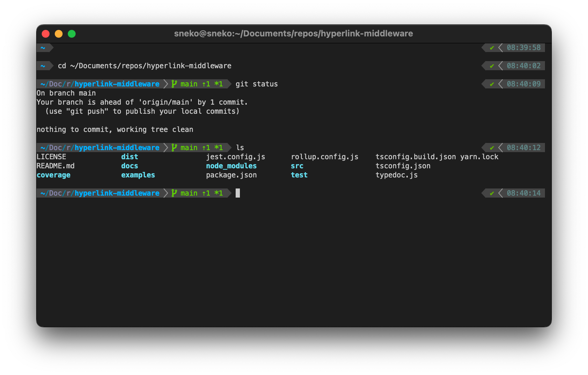

# sneko's 🫥files

> These are my dotfiles for my daily usage, if you want to quick start a setup and get the same terminal style... you can use it by cloning the repository and following instructions below.
>
> In addition you can find the tools I see needed for the daily usage of a developer. Why? Because this tool list helps a bit my memory in case of a new environment 🥰... and it can give you some tips/ideas!
>
> Note: it's very likely you would customize my settings then, so probably better to fork the repository to keep your own backup. By the way... don't forget to replace the nickname `sneko` where appropriate (perform a `Find all` with your IDE) 🫠



## Set up dotfiles

1. Install [Dotter](https://github.com/SuperCuber/dotter)
2. Clone this repository to your computer: `git clone https://github.com/sneko/dotfiles.git`
3. ⚠️ In the repository folder just deploy files: `dotter deploy` **(this may override your own files so please do backups if appropriate)** ⚠️

**Remember this will only install settings files, it won't bring tools binaries by magic 🪄. I put a link for each tool in the following section so you can follow their latest installation guide.**

_If you don't need all my stuff, adjust the repository folder before deploying._

### Tips for `.vscode/settings.json`

The Visual Studio Code configuration location depends on the OS so for now you need to use your own custom symlink if wanted (I will try to improve this later, `dotter` may have conditioning for this).

Reference: https://stackoverflow.com/questions/44575312/change-vscode-user-settings-location

### Tips for `.gitconfig`

I did not set my personal data into the committed `.gitconfig`, but this one will include the file `.gitconfig.local` to set sensitive information. In my case it results in:

```
[user]
	email = thomas@mydomain.com
	name = Thomas Ramé
```

### Tips for `.zshrc`

Almost all `Oh My Zsh` plugins I use are embedded when installing, but some require a manual install:

- `zsh-autosuggestions`: https://github.com/zsh-users/zsh-autosuggestions/blob/master/INSTALL.md
- `zsh-syntax-highlighting`: https://github.com/zsh-users/zsh-syntax-highlighting/blob/master/INSTALL.md
- `zsh-history-substring-search`: https://github.com/zsh-users/zsh-history-substring-search
- `auto-notify`: https://github.com/MichaelAquilina/zsh-auto-notify

### Tips for `.asdfrc`

You must install plugins to manage languages/clients you use:

- node: https://github.com/asdf-vm/asdf-nodejs
- golang: https://github.com/kennyp/asdf-golang
- rust: https://github.com/asdf-community/asdf-rust
- python: https://github.com/danhper/asdf-python
- ruby: https://github.com/asdf-vm/asdf-ruby

- kubectl: https://github.com/asdf-community/asdf-kubectl
- istioctl: https://github.com/virtualstaticvoid/asdf-istioctl
- mysql: https://github.com/iroddis/asdf-mysql
- postgresql: https://github.com/smashedtoatoms/asdf-postgres
- poetry: https://github.com/asdf-community/asdf-poetry

**Note: when you install global binaries like with `go install ...` or `npm -g ...` it won't be available in the shell until you do `asdf reshim <name> <version>`.**

## Tools associated with the dotfiles

Below you will find an overview of the tools I use daily, some have their dotfiles included in this repository, some others have not but are mentioned for my memory in case of a full reset (or because they are remote tools 😊).

I tried to categorize and separate those with or without dotfiles, while including a brief overview of what's the purpose of each tool.

- 🎁 Dotfiles embedded in this repository
- 🛰️ Listed for tracking (either no dotfiles or remote tools through a browser)

_Note: tools listed are preferably open-source and well-adopted so they keep being maintained._

### Raw list of tools for quick installation

Since reading and following installation instructions is valueless, I wrote the [packages.ini](packages.ini) so you can cherry-pick the "technical names of the tools" you want, to install them through your favorite package manager (or extension manager).

Depending on your platform the manager will be different. Here are some examples:

- Windows: [Scoop](https://scoop.sh/)
- MacOS: [Homebrew](https://brew.sh/)
- Linux: _I have no reference, but could depend on your platform `apt`, `yum`..._

_Tools listed in the [packages.ini](packages.ini) cannot totally reflect what's written below due to SaaS products and so on... so it can still be worth to read both!_

### Terminal

- Shell: [zsh](https://www.zsh.org/) 🎁 _(interactive shell, now set by default on Macbooks)_
  - It has been configured to not keep history of a sensible command if you prefix it with a space
- Terminal: [alacritty](https://alacritty.org/) 🎁 _(brings more features than my default MacOS terminal, and it's cross-platform so great when I end on a company computer Linux/Windows...)_
  - Terminal splitter: [tmux](https://github.com/tmux/tmux/wiki) 🎁 _(dealing with multiple Terminals is painful if they cannot be splitted into 1 window, that does the trick! My settins base is from https://github.com/gpakosz/.tmux thanks to the maintainer!)_
    - tmux plugins: [tmp](https://github.com/tmux-plugins/tpm)
- Shell plugins/themes manager: [Oh My Zsh](https://ohmyz.sh/) 🎁 _(it's a framework to easily get cool stuff into your shell like autocompletion)_

  - Theme: [powerlevel10k](https://github.com/romkatv/powerlevel10k) 🎁 _(one of the fastest themes and fully customizable)_
    - It required me to install the mentioned font first
    - I set the font into my `alacritty` terminal but also into the default MacOS Terminal (see their README)
    - To make colors great I use the `iTerm` default colors while setting as background/foreground the `Visual Studio Code` style
  - Plugins:
    - _(the list is described into the `Oh My Zsh` config)_

- Editor: [micro](https://micro-editor.github.io/) 🛰️ _(replaced my old `nano` to get harmonized shortcuts and advanced features)_

### Development

- IDE: [Visual Studio Code](https://code.visualstudio.com/) 🎁 _(the community is so present that I cannot go back to my previous IDEs)_
  - Extensions:
    - _(the list is described into [packages.ini](packages.ini) under the `[vscode]` section)_
- Code formatter: [prettier](https://prettier.io/) 🎁 _(for web languages that don't embed a code formatter by default, it's pretty handy! `.js`, `.json`, `.yaml`, ...)_
  - I enabled the extension into `Visual Studio Code`
- Version control system: [git](https://git-scm.com/) 🎁 _(became a standard)_
- Git GUI: [Fork](https://git-fork.com/) 🛰️ _(GitKraken did the job but I fell in love with Fork, maintained by 2 developers who are pretty reactive in case of issues)_
- Version manager for many languages: [asdf](https://asdf-vm.com/) 🎁 _(replaces `nvm`, `gvm`... dealing with multiple version managers can be painful, this is the right fit!)_
- Binary tool manager: [brew](https://brew.sh/) 🛰️ _(requires MacOS. Almost all tools are available, it avoids dealing with manual updates...)_
- Web based repositories: _no specific one, either GitHub, Bitbucket, Gitlab... the one that fits your project, pricing and your values_
- Realtime collaborative conception (diagram/flowchat): [diagrams.net](https://www.diagrams.net/) 🛰️ _(if you do or mimic `Unified Modeling Language (UML)` this tool is the best, compatible with multiple drive providers! Also there are native versions for all platforms and an extension for VSCode so you bring schemas next to your code!)_
- Realtime collaborative development: [Live Share](https://marketplace.visualstudio.com/items?itemName=MS-vsliveshare.vsliveshare) 🛰️ _(it's a VSCode extension)_
- Helpers: [DevToys](https://github.com/ObuchiYuki/DevToysMac) to convert/encode/decode/format/generate things like URL/HTML/Base64/JWT/UUID/date/LoremIpsum/Hash...

#### Mobile development

- Android development: Android Studio 🛰️ _(I'm just using it for specific debugging, but all the code is done in my main IDE)_
- Apple development: Xcode 🛰️ _(requires a MacOS. I'm just using it for specific debugging, but all the code is done in my main IDE)_
- Native deployments: [Fastlane](https://fastlane.tools/) 🛰️ _(since that's a real mess to manage multiple store APIs since they change things every 2 months... it's better to use a community tool for this, not reaching the APIs directly_ 😉 _)_

### Out of the scope 🛰️🛰️🛰️

Below are some tools that do not fit this repository but can be helpful. I did not include tools specific to my projects (like `Vue`, `Typescript`, `Storybook`, `Sentry`...) because some great `awesome-*` repositories exist per language or environment if you need.

#### Design

- Mockups and simple graphics: [Figma](https://www.figma.com/) 🛰️ _(free, it allows collaborating on mockups (static or interactive), which is great!)_

For more advanced use cases I'm used to the Adobe Suite... sorry it's not open-source:

- Animations: Adobe After Effects 🛰️ _(paid, with the `bodymovin` plugin it's easy to export [Lotty](https://lottiefiles.com/) files to get animations on web and native platforms)_
- Detailed graphics: Adobe Photoshop & Adobe Illustrator 🛰️ _(paid, but a reference)_

#### Collaboration & project management

- Task management: [ClickUp](https://www.clickup.com/) 🛰️ _(freemium, flexible and less heavy than the known Alassian JIRA, and more powerful than a Trello)_
- Shared drive: _no preference here, as long as you keep track of your development decisions, schemas, graphics... it will save you time!_
- Realtime documents tools: Google Documents 🛰️ _(depends on your privacy needs... but by far the most advanced)_

#### Security

I won't go into details but, there are many `password managers` out there, either free but self-hosted or paid but with great extensions, services...

To list some:

- 1Password _(paid)_
- [Bitwarden](https://github.com/bitwarden) _(open-source but can be SaaS)_
- ...

Do not forget to enable 2FA (two-factor authentication) on your accounts to improve the security:

- Either through a `TOTP` application (Google Authenticator, Microsoft Authenticator... this can also be in your password manager): they generate a unique 6-chars code each 30 seconds (don't forget to back them up)
- Or hardware with security keys (current standard is `WebAuthn` and gains popularity with big players) (same here, a backup is needed, so probably multiple keys)

## Contributions

This repository represents a fragment of what I use daily, so no contribution is likely to be merged. But you can still ask a question (issue) if you get into troubles with my setup.

Also, if you know great replacements to the listed tools, I may be interested 🙏
